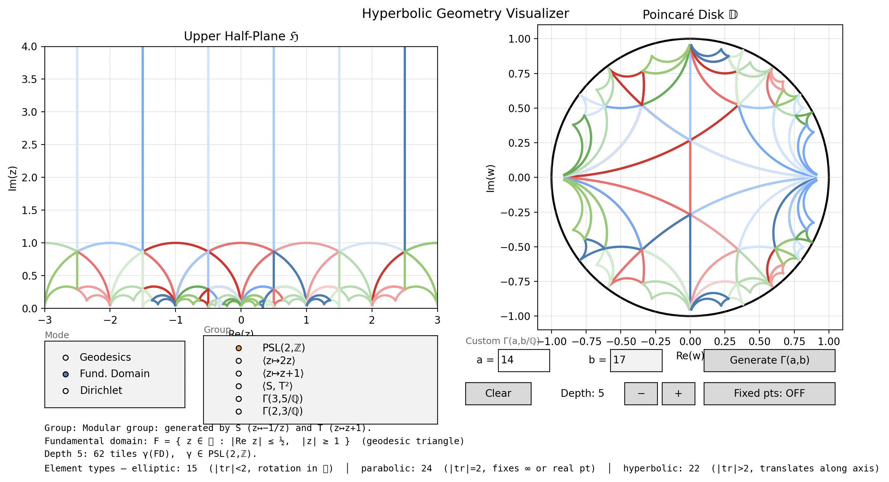

# Fuchsian Visualizer



An interactive visualizer for hyperbolic geometry and Fuchsian groups, built in Python with matplotlib.

Displays the **upper half-plane ℌ** and **Poincaré disk 𝔻** side by side, linked via the Cayley map. Based on Katok, *Fuchsian Groups* (1992).

## Features

### Visualization modes

| Mode | Description |
|------|-------------|
| **Geodesics** | Click two points in either panel to draw the hyperbolic geodesic through them |
| **Fundamental Domain** | Tessellate ℌ by γ(F) for γ in the selected group; tiles colored by element type |
| **Dirichlet Domain** | Click a basepoint z₀ to compute D(z₀) = { z : ρ(z,z₀) ≤ ρ(z,γ(z₀)) for all γ } |

### Groups

**Built-in presets:**

| Group | Description |
|-------|-------------|
| PSL(2,ℤ) | Modular group, generated by S: z↦−1/z and T: z↦z+1 |
| ⟨z↦2z⟩ | Cyclic hyperbolic group |
| ⟨z↦z+1⟩ | Cyclic parabolic group |
| ⟨S, T²⟩ | Theta group, index 3 in PSL(2,ℤ) |
| Γ(3,5/ℚ) | Quaternion algebra group — compact quotient, all elements hyperbolic |
| Γ(2,3/ℚ) | Quaternion algebra group — compact quotient, all elements hyperbolic |

**Custom quaternion groups** (see below).

### Tessellation colors and element types

In **Fundamental Domain** mode, ℌ is tiled by copies γ(F) of the fundamental domain F, one per group element γ. Each tile is colored by the **type** of γ, determined by |tr γ|:

| Color | Type | Condition | Geometry |
|-------|------|-----------|----------|
| Red | **Elliptic** | \|tr\| < 2 | Rotation about a fixed point inside ℌ. The fixed point is the unique point left in place; all others orbit around it. |
| Blue | **Parabolic** | \|tr\| = 2 | Fixes exactly one point on the boundary ∂ℌ (a real number or ∞). Moves every interior point along a horocycle — a circle internally tangent to ∂ℌ at the fixed point. |
| Green | **Hyperbolic** | \|tr\| > 2 | Fixes exactly two points on ∂ℌ. There is a unique geodesic connecting them (the **axis**); the transformation translates every point on the axis by a fixed hyperbolic distance, and drags all other points along curves that asymptotically approach the axis. Think of it as the hyperbolic analogue of a Euclidean translation, but constrained to act along one geodesic. |

Shading within each color family varies with depth — lighter means farther from the identity. A **Fixed pts** toggle marks the fixed points of each element in both panels.

### Quaternion algebra groups (Katok §5.2)

Given integers a > 0 and b ≠ 0, the quaternion algebra A = (a,b/ℚ) has basis {1, i, j, k} with i²=a, j²=b, k=ij=−ji. The standard integer order O = {x₀+x₁i+x₂j+x₃k | xᵢ∈ℤ} yields the Fuchsian group

```
Γ(A, O) = ρ₁(O¹) / {±I}  ⊂  PSL(2, ℝ)
```

where O¹ = { x ∈ O | x₀²−ax₁²−bx₂²+abx₃² = 1 } and the embedding is

```
ρ₁(x) = [[ x₀ + x₁√a,      x₂ + x₃√a  ],
           [ b(x₂ − x₃√a),  x₀ − x₁√a  ]]
```

When A is a **division algebra** (e.g. b prime and a a quadratic non-residue mod b), Γ(A,O)\ℌ is **compact** — no cusps, purely hyperbolic elements (Theorems 5.2.5, 5.4.1).

**Custom input:** enter any a, b in the "Custom Γ(a,b/ℚ)" fields and click **Generate Γ(a,b)**. The app checks whether A is a division algebra and reports the result in the description panel.

## Installation

```bash
pip install matplotlib numpy
```

## Usage

```bash
python3 visualizer.py
```

## Project layout

```
fuchsian_visualizer/
  visualizer.py        # all math and UI
  tests/
    test_math.py       # 39 unit tests (pure math, no display)
  docs/
    visualizer_plan.md   # geodesic visualizer design
    domains_plan.md      # fundamental/Dirichlet domain design
    groups_plan.md       # multiple groups + element types design
    quaternion_plan.md   # quaternion algebra groups design
```

## Running tests

```bash
python3 -m pytest tests/ -v
```
